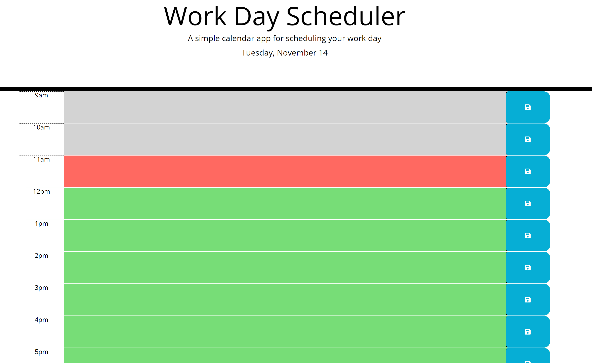

# Work Day Scheduler

Work Day Scheduler is a simple, browser-based calendar application designed for employees with busy schedules. It allows users to add important events to a daily planner, helping them to manage their time effectively.

## Screenshot

## Features

- **Current Day Display**: Displays the current day at the top of the calendar.
- **Timeblocks for Business Hours**: Presents timeblocks for standard business hours.
- **Color-Coded Timeblocks**: Color-codes each timeblock to indicate past, present, or future.
- **Event Entry**: Allows users to enter events by clicking on a timeblock.
- **Local Storage of Events**: Saves events in local storage when the save button is clicked. [TO DO]
- **Persistence**: Events persist between page refreshes. [TO DO]

## Usage

1. **Open the App**: Launch the app in your browser. You will see the current day displayed at the top.
2. **Add Events**: Click on a timeblock and enter the details of your event.
3. **Save Events**: Click the save button next to the timeblock to save the event.
4. **View Events**: Events are color-coded. Past events are one color, the current event is another, and future events are yet another color.

## Deployed Application

You can access the live application at the following URL: [Work Day Scheduler](https://claudiabiplus.github.io/work-day-scheduler/)
